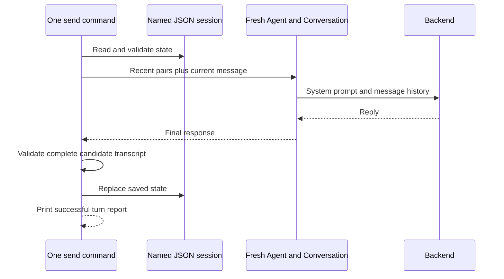

A conversational application needs to decide which messages belong to a session, what a later process should restore, and when a reply becomes part of the saved transcript. This guide builds a small command-line application with those decisions made explicit.

Part 1 creates two named sessions and continues them across separate invocations. [Part 2](/chat-sessions/history-and-failures) explains context selection, failed turns, file validation, and the integration tests. You use real Swarms `Agent` and its `Conversation`; the default scripted backend supplies fixed answers so you can inspect the application without a provider key.

## Choose the saved conversation contract

Swarms [persistent agent memory](/agents/agent-memory) uses a `MEMORY.md` file keyed by the agent name and writes conversation entries as they arrive. That is useful when you want the agent's native history to persist automatically.

For this application, the saved unit is a **complete user/assistant pair**. A session file gains a pair only after the Agent produces an acceptable reply and the replacement file is ready. Failed attempts stay out of the saved transcript. A new process rebuilds the recent context from these pairs and constructs a fresh Agent.



The CLI has three commands: `create`, `send`, and `show`. Each command exits after its work, so sending a second message already exercises restart behavior. Session files are local, human-readable JSON. Run one writer per session; the companion is not a shared chat server.

## Install the companion

Clone the [documentation repository](https://github.com/The-Swarm-Corporation/swarms-framework-docs) and work from its root. Create and activate a Python 3.12 virtual environment using the [environment setup guide](/environment-setup), then install:

```bash
python -m pip install -r examples/chat-sessions/requirements.txt
```

The [companion directory](https://github.com/The-Swarm-Corporation/swarms-framework-docs/tree/main/examples/chat-sessions) contains `sessions.py`, its tests, and pinned requirements for Swarms 15.0.3 and pytest 9.1.1.

Swarms needs a writable workspace and may initialize its standard conversation directory under your home directory. Before importing Swarms, the companion sets `WORKSPACE_DIR`, enables LiteLLM's local model-cost map, and sets `SWARMS_TELEMETRY_ON=false` to disable optional Swarms telemetry. The scripted backend performs no model inference; these settings do not promise that every possible SDK network activity is disabled.

## Create a session and save its first turn

Use a new store directory for this walkthrough. The global `--store` option must appear before the command name:

```bash
python examples/chat-sessions/sessions.py --store chat-demo create travel --history-turns 2
python examples/chat-sessions/sessions.py --store chat-demo send travel "My destination is Kyoto." --response "I have noted Kyoto."
```

`create` writes `chat-demo/travel.json` using exclusive creation. It refuses to overwrite a session that already exists. The `--history-turns 2` option records how many previous complete pairs each later send should include.

Without `--model`, a new session has `mode: "scripted"`. Each scripted send requires `--response`; that exact text is returned by a custom backend through the real Agent. The answer is a fixture you supply, not evidence that a model understood the message.

The first send prints:

```json
{
  "session": "travel",
  "mode": "scripted",
  "turn": 1,
  "history_turns_sent": 0,
  "older_turns_omitted": 0,
  "answer": "I have noted Kyoto."
}
```

`turn` counts saved complete pairs, including the new pair. `history_turns_sent` counts previous pairs supplied to this run. It excludes the current user message.

## Continue after the first process exits

Run another command:

```bash
python examples/chat-sessions/sessions.py --store chat-demo send travel "Which destination did I choose?" --response "You chose Kyoto."
python examples/chat-sessions/sessions.py --store chat-demo show travel
```

The second report has `turn: 2` and `history_turns_sent: 1`. `show` loads and validates the saved file without running an Agent. Its state has this structure:

```json
{
  "schema_version": 1,
  "session": "travel",
  "config": {
    "mode": "scripted",
    "model_name": "gpt-4o-mini",
    "system_prompt": "You are a concise conversational assistant. Use the provided recent chat history. You have no tools.",
    "history_turns": 2
  },
  "turns": [
    {
      "user": "My destination is Kyoto.",
      "assistant": "I have noted Kyoto."
    },
    {
      "user": "Which destination did I choose?",
      "assistant": "You chose Kyoto."
    }
  ]
}
```

The stored mode, model name, system prompt, and history limit determine the next invocation's configuration. The scripted mode still records a model name for a stable configuration shape; it supplies a custom backend, so that name does not cause a provider call.

The transcript contains no incomplete turns, arbitrary message roles, internal Agent metadata, or serialized Agent objects. Its schema is owned by this application. Do not load it with the SDK's native state-loading methods.

## Keep a second conversation separate

```bash
python examples/chat-sessions/sessions.py --store chat-demo create cooking
python examples/chat-sessions/sessions.py --store chat-demo send cooking "I prefer vegetarian meals." --response "I have noted that preference."
python examples/chat-sessions/sessions.py --store chat-demo show travel
```

`cooking.json` and `travel.json` have separate histories. Every send constructs a new Agent with a unique name, disables native persistence and autosave, and passes only the selected session's recent pairs. The cooking request therefore has no travel messages in its supplied context.

This is application state separation on a local filesystem, not an authorization boundary. Anyone who can read or modify the store can read or modify its transcripts and configuration.

## Pass history into the real Agent

The companion's `history_messages` function converts the newest saved pairs into ordered standard chat messages:

```python
def history_messages(state):
    selected = state["turns"][-state["config"]["history_turns"]:]
    return [
        {"role": role, "content": turn[key]}
        for turn in selected
        for role, key in (("user", "user"), ("assistant", "assistant"))
    ]
```

`send_turn` then calls `agent.run(task=message, messages=messages)`. Swarms 15.0.3 incorporates those messages into its real in-memory `Conversation` and gives the model the supplied history with the current task. The saved pairs do not include the current message yet; it is passed once through `task`.

Each Agent uses the session's system prompt and model name, `max_loops=1`, `retry_attempts=1`, and `output_type="final"`. It has no tools. Native persistence, autosave, automatic context compression, dynamic context sizing, and streaming are disabled so the companion controls which previous turns enter each call.

## Opt into a provider-backed conversation

After completing the scripted walkthrough, configure a provider key as described in [model providers](/integrations/model-providers). Create a separate session with a model identifier supported by your provider:

```bash
python examples/chat-sessions/sessions.py --store chat-demo create live-travel --model gpt-4o-mini --history-turns 4
python examples/chat-sessions/sessions.py --store chat-demo send live-travel "I want to visit Kyoto in spring."
python examples/chat-sessions/sessions.py --store chat-demo send live-travel "What should I plan first?"
```

`create --model` only stores configuration. A later `send` can make a billable model request. Omit `--response` for provider sessions; the application rejects mixing a scripted backend with a provider session or a missing backend with a scripted session.

A provider answer can fail the application limits, or saving it can fail after generation. Such a turn is not committed, but the provider may already have charged for the request. This tutorial's tests use scripted backends only and make no claim about model answer quality.

Continue to [history limits and failed turns](/chat-sessions/history-and-failures) before using the companion for longer conversations.
