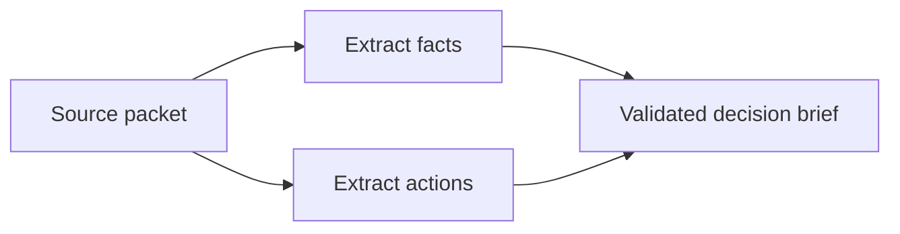

Build a document-processing application with four stages: prepare source text, extract facts and actions in parallel, and synthesize a brief after both analyses finish. This first part explains the data flow and runs the complete application. [Part 2](/document-pipelines/validate) adds the checks you need before adapting it to your own documents or model.

The companion uses the real `GraphWorkflow` and `Agent` classes from **Swarms 15.0.3**. Its default demonstration supplies scripted responses, so you can inspect orchestration and error handling without credentials or model inference. The fixture is written for one synthetic meeting document; it does not analyze new documents.

## Choose a graph for the dependency structure

Facts and action items need the same source, but neither needs the other's output. Run those stages side by side. The brief depends on both, so it belongs in the next graph layer.



`Source` is a small deterministic Python node. `Facts`, `Actions`, and `Brief` each wrap a real Swarms `Agent` with an application validation step. The adapters expose `agent_name` and `run`, which this GraphWorkflow release accepts as node objects. They are application code, not new Swarms classes.

This topology keeps document preparation reproducible while allowing the two different analysis prompts to run concurrently. A sequential workflow would introduce an unnecessary dependency between the analyses. A flat concurrent workflow would not express the brief's dependency on both results.

## Get the runnable companion

Clone the [documentation repository](https://github.com/The-Swarm-Corporation/swarms-framework-docs) and work from its root. Use Python 3.12 in a virtual environment; see [environment setup](/environment-setup) if you need activation instructions.

```bash
git clone https://github.com/The-Swarm-Corporation/swarms-framework-docs.git
cd swarms-framework-docs
python -m venv .venv
```

Activate the environment, then install the example's pinned requirements:

```bash
python -m pip install -r examples/document-pipeline/requirements.txt
```

Swarms needs a writable workspace and may initialize its standard conversation directory under your home directory even with persistent memory disabled. The companion sets `WORKSPACE_DIR` before importing Swarms and uses LiteLLM's local model-cost map. It makes no claim of an air-gapped runtime; the scripted backend avoids model inference, not every possible SDK network activity.

The [companion directory](https://github.com/The-Swarm-Corporation/swarms-framework-docs/tree/main/examples/document-pipeline) contains:

| File | Purpose |
| --- | --- |
| `pipeline.py` | Input loader, contracts, graph construction, validation, and command-line entry point |
| `meeting.txt` | A synthetic six-line pilot planning document |
| `scripted-responses.json` | One fixed answer for each analysis stage and the brief |
| `test_pipeline.py` | Integration checks that exercise real agents and graph execution |
| `requirements.txt` | Tested Swarms and pytest versions |

## Preserve the source before asking agents to interpret it

`load_document` reads a UTF-8 text file with a 24,000-byte limit. It rejects missing, empty, undecodable, oversized, and NUL-containing input before constructing any agents. This example does not extract PDF text, perform OCR, fetch remote files, or split long documents into chunks.

The source packet records the filename, a SHA-256 hash of the original bytes, and one-based line numbers. Blank lines retain their positions. The hash distinguishes document revisions; it is not a claim that the source is trustworthy. Avoid changing whitespace or line endings between preparing the packet and checking citations.

An abbreviated packet looks like this:

```json
{
  "document": "meeting.txt",
  "sha256": "hash of the original file bytes",
  "lines": [
    {"line": 1, "text": "Atlas pilot meeting, 18 September 2026"},
    {"line": 2, "text": "Decision: the pilot will launch on 5 October with the existing export format."}
  ]
}
```

The application passes a short, fixed instruction to `graph.run`. The document itself enters through `Source`, so dependencies carry an explicitly identified packet instead of relying on an agent to locate a file.

## Define what each stage may produce

Each agent receives its own system prompt and a JSON Schema generated from a Pydantic model. The prompt requests JSON; Python then checks the returned text. The prompt alone is not an output guarantee.

| Stage | Output contract | Additional validation |
| --- | --- | --- |
| `Facts` | Facts with unique `fact-N` IDs, statements, and evidence | Every quote must occur on the specified source line |
| `Actions` | Actions with unique `action-N` IDs, descriptions, nullable owners and due dates, and evidence | The same citation check; unspecified owners and dates are requested as `null` |
| `Brief` | Summary text plus lists of fact and action IDs | References must exist in the corresponding validated analysis; duplicates and a completely unreferenced brief are rejected |

The application limits each analysis to 20 items and each item's evidence to five citations. Adapt those bounds deliberately for another task. A document with no extractable items can produce empty analysis lists, but this example blocks a final brief with no supporting item references.

Successful stages return a versioned JSON envelope containing `stage`, `status`, and `data`. Failed stages return a `blocked` envelope. These fields belong to the application protocol; GraphWorkflow does not impose them.

## Connect and compile the graph

The relevant construction in `build_workflow` is:

```python
graph = GraphWorkflow(
    name="DocumentBrief",
    max_loops=1,
    max_parallel_nodes=2,
)
graph.add_node(SourceNode(document))

# stages contains the three ValidatedStage adapters, each owning a fresh Agent.
for stage in stages.values():
    graph.add_node(stage)

graph.add_edges_from_source("Source", ["Facts", "Actions"])
graph.add_edges_to_target(["Facts", "Actions"], "Brief")
graph.compile()
```

This is an excerpt, not a second standalone implementation. The complete builder in `pipeline.py` constructs the agents and contracts first.

In this release, the graph sends each predecessor's output in a separate user message labelled with its node name, such as `Facts: ...`. The newest `task` contains the graph's collaboration instruction. The adapter reads the named predecessor messages, not just the newest task, and requires exactly one successful envelope from each expected dependency. It does not rely on which parallel branch finished first.

Compilation checks the graph structure. Application validation checks the content flowing through it. Use the [GraphWorkflow reference](/api/graph-workflow) for other topology and execution options.

## Run the scripted document

From the repository root:

```bash
python examples/document-pipeline/pipeline.py --document examples/document-pipeline/meeting.txt --responses examples/document-pipeline/scripted-responses.json --output document-report.json
```

The final console line reports `mode: "scripted"`, `complete: true`, and `ok` for all four stages. The saved report includes the source packet, each validated stage, the raw model responses, and the final brief. It preserves the accessibility action's unknown owner and date as `null` rather than filling them in.

Inspect these fields in `document-report.json`:

- `source.sha256` identifies the input revision.
- `stages.Facts.data.facts` contains three facts with exact source citations.
- `stages.Actions.data.actions` contains two action items.
- `brief.fact_ids` and `brief.action_ids` identify the items used for synthesis.

`complete: true` means this run passed the application's structural and reference checks. It does not establish that a model found every relevant fact, interpreted the document correctly, or wrote a faithful summary. Here, the answers are fixed fixtures. Continue to [validate handoffs and handle failures](/document-pipelines/validate) before selecting a provider model.
