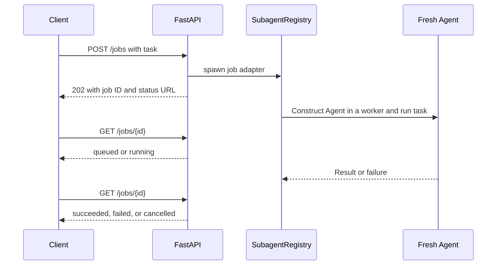

An agent run can take longer than you want to keep one HTTP request open. Instead of holding the submission request until generation finishes, return a job ID and let the client retrieve its state later.

This two-part guide builds that workflow using real Swarms `SubagentRegistry` and `Agent` objects. Part 1 runs the local service and client. [Part 2](/job-api/capacity-and-shutdown) explains admission limits, queued cancellation, shutdown, and the integration tests.

The service is a **single-process local example** with in-memory records. Its default demonstration uses a fixed model response through a real Agent, requires no provider key, and performs no model inference. It does not survive process restarts or provide authentication. Keep the loopback binding while learning this workflow.

## Understand the request lifecycle



HTTP `202 Accepted` confirms admission to this process. It does not confirm agent success. The response includes a `Location` header and `status_url` that identify the job's polling endpoint.

Agent construction also occurs inside a registry worker. Constructing a model-backed agent in the submission handler can itself delay the event loop, even before `Agent.run` begins. The `JobAgent` adapter defers both construction and execution so that submission and health requests can finish while the worker is busy.

## Install the companion

Clone the [documentation repository](https://github.com/The-Swarm-Corporation/swarms-framework-docs) and work from its root. Create and activate a Python 3.12 virtual environment using the [environment setup guide](/environment-setup), then install:

```bash
python -m pip install -r examples/background-jobs/requirements.txt
```

The [companion directory](https://github.com/The-Swarm-Corporation/swarms-framework-docs/tree/main/examples/background-jobs) contains `service.py`, `client.py`, the test suite, and pinned requirements. The example targets Swarms 15.0.3, FastAPI 0.141.1, HTTPX 0.28.1, and Uvicorn 0.53.0.

Swarms needs a writable workspace and may initialize its standard conversation directory under your home directory. Before importing Swarms, the service configures `WORKSPACE_DIR`, uses LiteLLM's local model-cost map, and sets `SWARMS_TELEMETRY_ON=false` to disable optional Swarms telemetry. The scripted backend avoids inference; these settings do not promise that every possible SDK network activity is disabled.

## Start the local service

In the first terminal:

```bash
python examples/background-jobs/service.py --scripted
```

The service listens on `http://127.0.0.1:8030`. Its OpenAPI interface is available at `/docs`, and `/health` reports liveness plus current admission counts. `--scripted` selects a custom model backend that returns the same sentence for every task. Its answers demonstrate transport and lifecycle behavior, not task reasoning.

The entry point configures one Uvicorn process. Do not add multiple server workers to this example: each process would have different in-memory job records, so a later request could reach a process that does not know the ID.

## Submit once, then inspect the result

In a second terminal, with the same environment activated:

```bash
python examples/background-jobs/client.py --output job-result.json submit "Write a short project update"
```

The client prints the accepted ID immediately, then polls until the job finishes or its waiting deadline expires. A completed scripted job resembles:

```json
{
  "id": "task-example",
  "status": "succeeded",
  "result": "This is a scripted response from a real Swarms Agent invocation.",
  "error": null
}
```

Actual IDs come from the registry. Use the printed ID in subsequent requests; the example ID above is illustrative. The client writes the terminal record to `job-result.json` when `--output` is supplied. For `submit` and `poll`, a failed or cancelled terminal job returns client exit code 1; a successful result returns 0. The separate `cancel` command returns 0 when its cancellation request succeeds.

You can stop waiting without cancelling or duplicating work:

```bash
python examples/background-jobs/client.py --wait 0 submit "A task to inspect later"
```

This submits once and makes one status request. If the job is still queued or running, the client exits with code 2 and prints the ID with an explanation that work was not cancelled. A fast scripted job may already be complete. Poll the existing ID later:

```bash
python examples/background-jobs/client.py --wait 30 --output job-result.json poll task-YOUR-ID
```

The polling deadline uses a monotonic clock. Each HTTP call has its own five-second timeout, so the overall elapsed wait can exceed `--wait` by an in-flight HTTP request. A client timeout, disconnected terminal, or lost response does not terminate an agent run.

Do not automatically repeat `POST /jobs` after an uncertain submission response. This example has no idempotency key or submission lookup: repeating the POST can create another job. Once you have an ID, retry GET requests against that ID instead.

## Keep each job's conversation separate

`JobService` receives a factory that constructs a new agent for every accepted job. The provided factory uses `max_loops=1`, `output_type="final"`, no tools, and disabled persistent memory. It never shares one Agent instance across concurrent jobs.

The adapter calls the actual `Agent.run` and requires a nonempty model response recorded during that invocation. This matters in Swarms 15.0.3 because an Agent can catch a backend exception without raising it back to the registry. Without checking the new response, the registry could mark an unusable return value as completed.

When construction or execution fails, the adapter raises to the registry. Polling then returns `status: "failed"`, `result: null`, and an error code/type. The HTTP response does not include the exception message. Consult local SDK output when diagnosing a failure. The response-history check is tied to this pinned, one-loop, no-tools configuration; retest it when changing versions or agent behavior.

## Read states without confusing acceptance with completion

| State | Meaning |
| --- | --- |
| `queued` | Accepted; the executor has not started this job |
| `running` | A worker has started construction or execution |
| `succeeded` | The adapter returned a nonempty model response |
| `failed` | Construction, execution, or response validation failed |
| `cancelled` | The underlying future was cancelled before its worker started |

The service derives these states from the registry task's public `Future`. In Swarms 15.0.3, the registry sets its task status to `RUNNING` before executor submission, including for work that must wait for a worker. Using that field alone would erase the useful queued/running distinction.

Completed records remain available until this process exits. The service does not persist them to a database. Export anything you want to keep, then continue to [capacity, cancellation, and shutdown](/job-api/capacity-and-shutdown).
